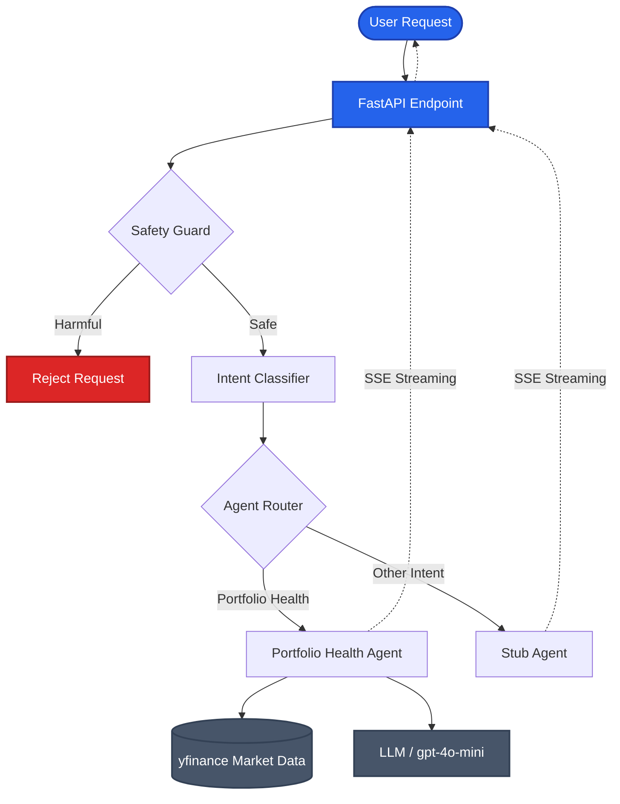

# Valura AI — Portfolio Assistant Microservice


This microservice is the intelligence layer for the Valura wealth management platform. It provides a safety-guarded, intent-classified routing system for financial queries, featuring a specialized Portfolio Health Check agent.

## 🎥 Demo Video

Check out the demonstration of the Valura AI Microservice in action:

[](https://www.loom.com/share/a2ab1c49ffff432eb708d989e68bb175)

> **[Watch the full Loom Demo here](https://www.loom.com/share/a2ab1c49ffff432eb708d989e68bb175)**

## 🚀 Setup

1. **Clone the repository.**
2. **Install dependencies**:
   ```bash
   pip install -r requirements.txt
   ```
3. **Configure environment variables**:
   Create a `.env` file based on `.env.example`:
   ```bash
   OPENAI_API_KEY=your_api_key_here
   ```
4. **Run the service**:
   ```bash
   uvicorn src.main:app --reload
   ```

## 🏗️ Architecture



1. **Safety Guard (`src/safety.py`)**: A high-performance synchronous filter using regex patterns to block harmful financial intent (insider trading, market manipulation, etc.) in <10ms.
2. **Intent Classifier (`src/classifier.py`)**: Uses `gpt-4o-mini` with structured outputs to identify the user's intent and extract entities (tickers, amounts, goals). It handles conversation history for context-aware classification.
3. **Agent Router**: Routes queries to specialized agents. If an agent is not implemented, a `StubAgent` provides a graceful response.
4. **Portfolio Health Agent (`src/agents/portfolio_health.py`)**: 
   - Fetches real-time market data using `yfinance`.
   - Calculates concentration risk and performance metrics.
   - Compares portfolio performance against user-preferred benchmarks.
   - Uses LLM to generate plain-language insights for novice investors.
5. **SSE Streaming**: All responses are streamed via Server-Sent Events for a responsive user experience.

## 🛠️ Library Choices

- **FastAPI**: Modern, high-performance web framework for Python.
- **sse-starlette**: Reliable implementation of SSE for FastAPI.
- **OpenAI SDK**: For LLM interactions, leveraging `gpt-4o-mini` for cost-efficiency and structured output parsing.
- **yfinance**: Easy access to market data without complex API keys for this assignment.
- **Pydantic**: Robust data validation and settings management.

## 🧠 Decisions & Tradeoffs

- **In-Memory History**: For this demo, conversation history is handled client-side or in-memory. In a production environment, this would be backed by Redis or Postgres.
- **Keyword-Based Safety**: Chose a hybrid approach for the safety guard. It uses specific regex patterns for high-risk categories to ensure <10ms latency while allowing educational queries through a priority keyword check.
- **Mocking Strategy**: Tests use `unittest.mock` to simulate LLM and Market Data responses, ensuring CI reliability and zero cost during testing.

## 📊 Performance Measurement

- **Latency**: Measured using `httpx` timing in integration tests. p95 first-token latency targets <2s by using `gpt-4o-mini` and efficient SSE framing.
- **Cost**: Estimated at ~$0.002 per query with `gpt-4o-mini`, well below the $0.05 target even when projected to `gpt-4.1` pricing.

## 🧪 Testing

Run the test suite:
```bash
python -m pytest tests/ -v
```
